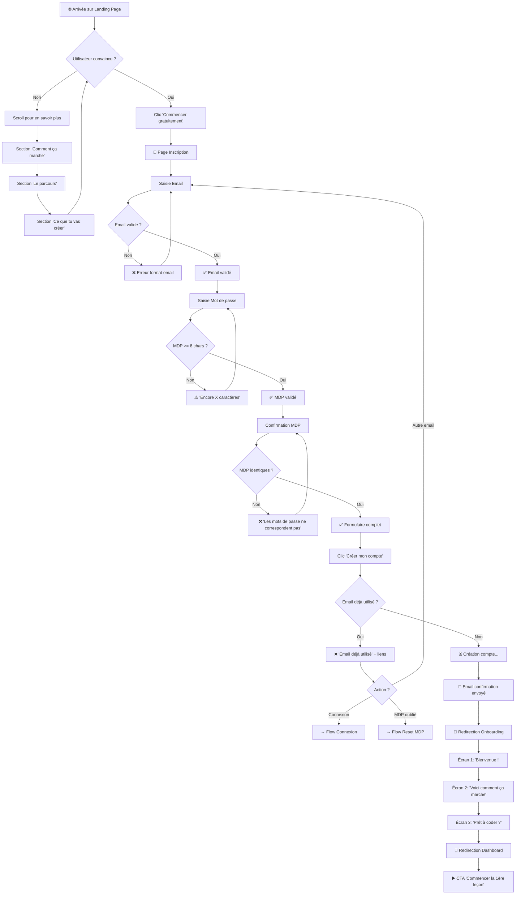
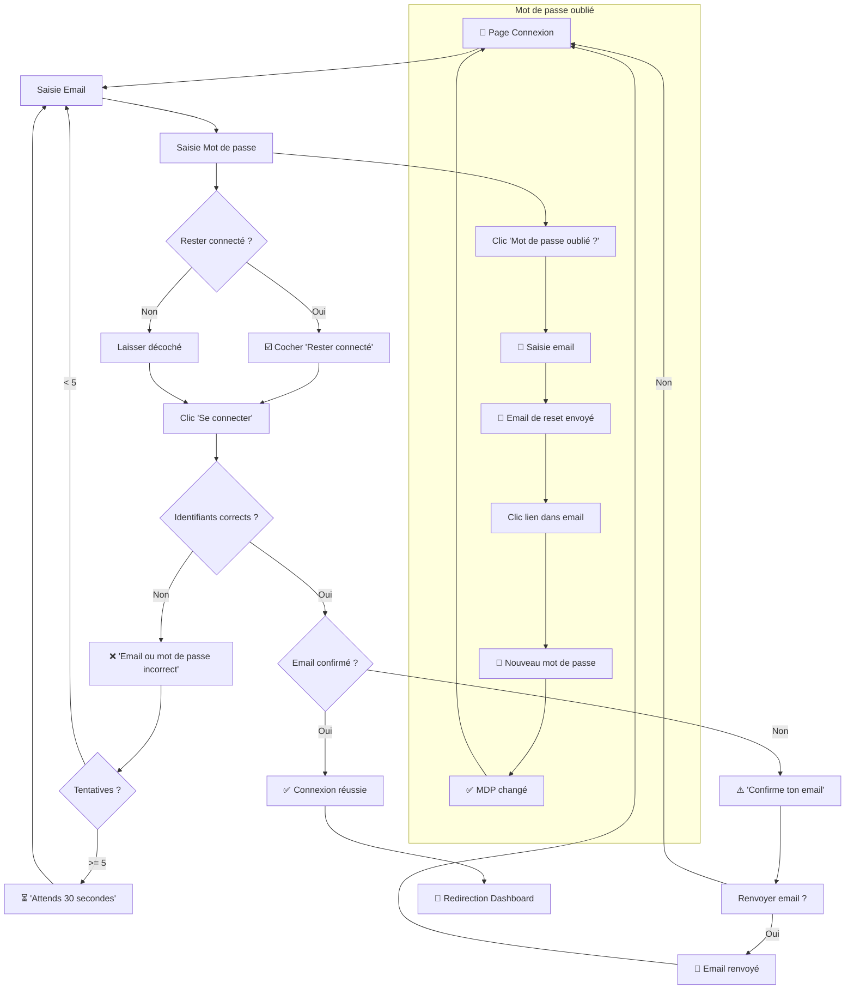
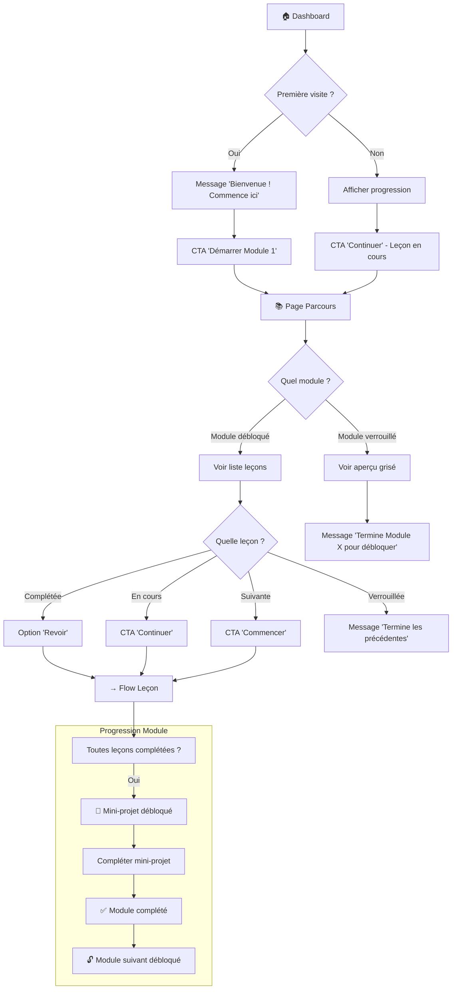
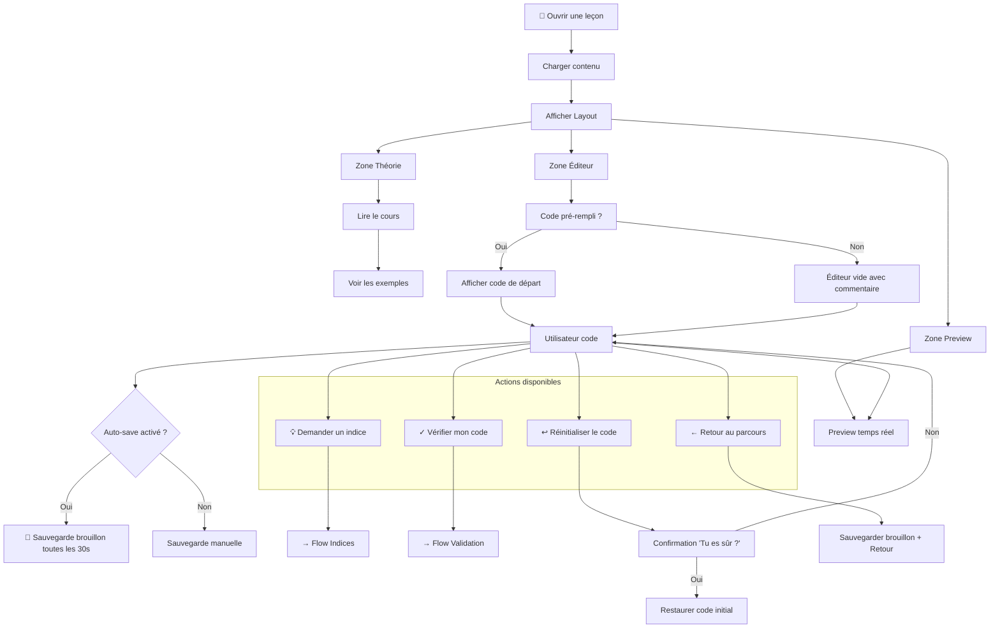
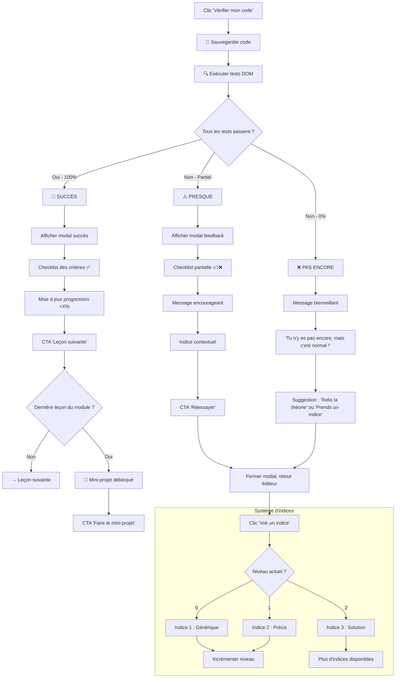
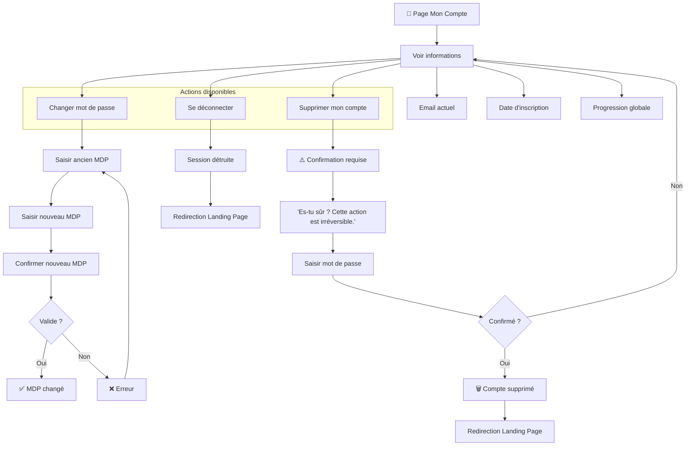

# User Flows — Pystep MVP

> **Créé par** : Sally (UX Designer)
> **Date** : 5 février 2026
> **Version** : 1.0
> **Basé sur** : PRD MVP v1.0, Wireframes UX v1.0

---

## Table des matières

1. [Vue d'ensemble](#1-vue-densemble)
2. [Flow 1 : Découverte → Inscription](#2-flow-1--découverte--inscription)
3. [Flow 2 : Connexion](#3-flow-2--connexion)
4. [Flow 3 : Parcours d'apprentissage](#4-flow-3--parcours-dapprentissage)
5. [Flow 4 : Suivre une leçon](#5-flow-4--suivre-une-leçon)
6. [Flow 5 : Validation d'exercice](#6-flow-5--validation-dexercice)
7. [Flow 6 : Gestion de compte](#7-flow-6--gestion-de-compte)
8. [Edge Cases & Erreurs](#8-edge-cases--erreurs)
9. [Parcours émotionnel](#9-parcours-émotionnel)

---

## 1. Vue d'ensemble

### Carte des parcours principaux

```
                                    ┌─────────────────────────────────────┐
                                    │                                     │
                                    │         PYSTEP - VUE GLOBALE        │
                                    │                                     │
                                    └─────────────────────────────────────┘
                                                      │
                    ┌─────────────────────────────────┼─────────────────────────────────┐
                    │                                 │                                 │
                    ▼                                 ▼                                 ▼
          ┌─────────────────┐               ┌─────────────────┐               ┌─────────────────┐
          │                 │               │                 │               │                 │
          │   VISITEUR      │               │   INSCRIT       │               │   APPRENANT     │
          │   (anonyme)     │               │   (nouveau)     │               │   (actif)       │
          │                 │               │                 │               │                 │
          └────────┬────────┘               └────────┬────────┘               └────────┬────────┘
                   │                                 │                                 │
        ┌──────────┼──────────┐                      │                    ┌────────────┼────────────┐
        │          │          │                      │                    │            │            │
        ▼          ▼          ▼                      ▼                    ▼            ▼            ▼
   ┌─────────┐ ┌─────────┐ ┌─────────┐        ┌──────────┐         ┌─────────┐  ┌─────────┐  ┌─────────┐
   │ Landing │ │Parcours │ │Connexion│        │Onboarding│         │Dashboard│  │ Leçon   │  │ Compte  │
   │  Page   │ │ (aperçu)│ │         │        │          │         │         │  │         │  │         │
   └─────────┘ └─────────┘ └─────────┘        └──────────┘         └─────────┘  └─────────┘  └─────────┘
```

### Personas et objectifs

| Persona | Objectif principal | Parcours prioritaire |
|---------|-------------------|---------------------|
| **Léa** (débutante curieuse) | Comprendre si c'est pour elle | Landing → Inscription → 1ère leçon |
| **Marc** (inscrit qui revient) | Reprendre où il en était | Connexion → Dashboard → Continuer |
| **Sophie** (motivée) | Finir le module en cours | Dashboard → Parcours → Leçons |

---

## 2. Flow 1 : Découverte → Inscription

### Diagramme Mermaid



### Écrans détaillés

```
ÉTAPE 1 : Landing Page
┌─────────────────────────────────────────────────────────────────────────────┐
│                                                                             │
│   Points de sortie vers inscription :                                       │
│   • Header : bouton "S'inscrire"                                           │
│   • Hero : CTA "Commencer gratuitement"                                    │
│   • Fin de page : CTA "Commencer maintenant"                               │
│                                                                             │
│   Temps moyen estimé sur page : 45-90 secondes                             │
│                                                                             │
└─────────────────────────────────────────────────────────────────────────────┘

ÉTAPE 2 : Formulaire Inscription
┌─────────────────────────────────────────────────────────────────────────────┐
│                                                                             │
│   Champs :                                                                  │
│   1. Email (validation temps réel)                                         │
│   2. Mot de passe (indicateur force optionnel)                             │
│   3. Confirmation mot de passe                                             │
│                                                                             │
│   Validations :                                                             │
│   • Email : format valide, non déjà utilisé                                │
│   • MDP : minimum 8 caractères                                             │
│   • Confirmation : identique au MDP                                        │
│                                                                             │
│   Temps estimé : 30-60 secondes                                            │
│                                                                             │
└─────────────────────────────────────────────────────────────────────────────┘

ÉTAPE 3 : Onboarding (3 écrans)
┌─────────────────────────────────────────────────────────────────────────────┐
│                                                                             │
│   Écran 1/3 : "Bienvenue sur Pystep, [Prénom] !"                           │
│   → Personnalisation immédiate                                              │
│   → Skip possible mais déconseillé                                         │
│                                                                             │
│   Écran 2/3 : "Voici comment ça marche"                                    │
│   → Explication rapide : Théorie → Code → Valide                           │
│   → Animation/illustration                                                  │
│                                                                             │
│   Écran 3/3 : "Prêt à créer ton premier site ?"                            │
│   → CTA fort : "C'est parti !"                                             │
│   → Motivation : "Dans 5 minutes, tu auras écrit ton premier code"         │
│                                                                             │
│   Temps total : 15-30 secondes (skippable)                                 │
│                                                                             │
└─────────────────────────────────────────────────────────────────────────────┘
```

### Métriques à suivre

| Métrique | Objectif | Outil |
|----------|----------|-------|
| Taux de conversion Landing → Inscription | > 15% | Analytics |
| Taux de complétion formulaire | > 80% | Form tracking |
| Temps moyen inscription | < 2 min | Analytics |
| Taux skip onboarding | < 30% | Event tracking |

---

## 3. Flow 2 : Connexion

### Diagramme Mermaid



### États et messages

```
ÉTAT : Connexion réussie
┌─────────────────────────────────────────────────────────────────────────────┐
│                                                                             │
│   Message : Aucun (redirection immédiate)                                  │
│   Action : Redirect vers Dashboard                                          │
│   Session : Créée (7 jours si "rester connecté", sinon session browser)    │
│                                                                             │
└─────────────────────────────────────────────────────────────────────────────┘

ÉTAT : Identifiants incorrects
┌─────────────────────────────────────────────────────────────────────────────┐
│                                                                             │
│   Message : "Email ou mot de passe incorrect"                              │
│   Note : NE PAS préciser lequel est faux (sécurité)                        │
│   Suggestion : Lien "Mot de passe oublié ?" mis en avant                   │
│                                                                             │
└─────────────────────────────────────────────────────────────────────────────┘

ÉTAT : Trop de tentatives
┌─────────────────────────────────────────────────────────────────────────────┐
│                                                                             │
│   Message : "Trop de tentatives. Réessaie dans 30 secondes."               │
│   Comportement : Bouton désactivé avec countdown                           │
│   Raison : Protection brute force                                          │
│                                                                             │
└─────────────────────────────────────────────────────────────────────────────┘

ÉTAT : Email non confirmé
┌─────────────────────────────────────────────────────────────────────────────┐
│                                                                             │
│   Message : "Tu n'as pas encore confirmé ton email."                       │
│   Action : Bouton "Renvoyer l'email de confirmation"                       │
│   Note : Bloquer l'accès tant que non confirmé ? (à décider)               │
│                                                                             │
└─────────────────────────────────────────────────────────────────────────────┘
```

---

## 4. Flow 3 : Parcours d'apprentissage

### Diagramme Mermaid



### Logique de déverrouillage

```
RÈGLES DE PROGRESSION
┌─────────────────────────────────────────────────────────────────────────────┐
│                                                                             │
│   LEÇONS                                                                   │
│   • Une leçon est débloquée si la précédente est complétée                 │
│   • Exception : Leçon 1.1 toujours débloquée                               │
│   • Une leçon complétée peut être revue à tout moment                      │
│                                                                             │
│   MINI-PROJETS                                                             │
│   • Débloqué quand toutes les leçons du module sont complétées             │
│   • Obligatoire pour débloquer le module suivant                           │
│                                                                             │
│   MODULES                                                                  │
│   • Module N+1 débloqué quand Module N est 100% complété                   │
│   • Module 1 toujours débloqué                                             │
│                                                                             │
└─────────────────────────────────────────────────────────────────────────────┘

EXEMPLE CONCRET
┌─────────────────────────────────────────────────────────────────────────────┐
│                                                                             │
│   Marie a complété :                                                       │
│   • 1.1 ✅  1.2 ✅  1.3 ✅  1.4 ▶️ (en cours)  1.5 🔒  1.6 🔒             │
│   • Mini-projet 1 🔒                                                       │
│   • Module 2 🔒                                                            │
│                                                                             │
│   Ce qu'elle peut faire :                                                  │
│   • Revoir 1.1, 1.2, 1.3                                                   │
│   • Continuer 1.4                                                          │
│   • PAS commencer 1.5 (1.4 non complétée)                                  │
│   • PAS voir Module 2 (Module 1 non terminé)                               │
│                                                                             │
└─────────────────────────────────────────────────────────────────────────────┘
```

---

## 5. Flow 4 : Suivre une leçon

### Diagramme Mermaid



### Comportement de l'éditeur

```
SAUVEGARDE AUTOMATIQUE
┌─────────────────────────────────────────────────────────────────────────────┐
│                                                                             │
│   Quand sauvegarder le brouillon ?                                         │
│   • Toutes les 30 secondes si modifications                                │
│   • À chaque clic sur "Indice"                                             │
│   • À chaque clic sur "Vérifier"                                           │
│   • Avant de quitter la page (beforeunload)                                │
│                                                                             │
│   Indicateur visuel :                                                       │
│   • "Sauvegardé ✓" discret en bas de l'éditeur                            │
│   • Pas de spinner intrusif                                                │
│                                                                             │
└─────────────────────────────────────────────────────────────────────────────┘

PREVIEW TEMPS RÉEL
┌─────────────────────────────────────────────────────────────────────────────┐
│                                                                             │
│   Comportement :                                                            │
│   • Mise à jour après 500ms sans frappe (debounce)                         │
│   • OU bouton "Rafraîchir" manuel                                          │
│   • Isolation dans iframe (sécurité)                                       │
│                                                                             │
│   Options preview :                                                         │
│   • Toggle Desktop/Mobile (largeur iframe)                                 │
│   • Resize manuel (drag)                                                   │
│                                                                             │
└─────────────────────────────────────────────────────────────────────────────┘

MOBILE : MODE TABS
┌─────────────────────────────────────────────────────────────────────────────┐
│                                                                             │
│   Sur mobile (< 768px) :                                                   │
│   • Tab 1 : Théorie + Exercice                                             │
│   • Tab 2 : Éditeur + Preview                                              │
│                                                                             │
│   Swipe entre les tabs possible                                            │
│   Badge notification si code non sauvegardé en changeant de tab            │
│                                                                             │
└─────────────────────────────────────────────────────────────────────────────┘
```

---

## 6. Flow 5 : Validation d'exercice

### Diagramme Mermaid



### Système de tests DOM

```
STRUCTURE D'UN TEST
┌─────────────────────────────────────────────────────────────────────────────┐
│                                                                             │
│   {                                                                         │
│     id: "test-1",                                                          │
│     name: "Un titre <h1> est présent",                                     │
│     hint: "N'oublie pas d'ajouter une balise <h1>",                        │
│     test: (doc) => doc.querySelector('h1') !== null                        │
│   }                                                                         │
│                                                                             │
│   Chaque leçon a 2-5 tests                                                 │
│   Tous doivent passer pour valider                                         │
│                                                                             │
└─────────────────────────────────────────────────────────────────────────────┘

EXEMPLE LEÇON 1.4 (Listes)
┌─────────────────────────────────────────────────────────────────────────────┐
│                                                                             │
│   Tests :                                                                   │
│   1. "Une liste <ul> est présente"                                         │
│      → doc.querySelector('ul') !== null                                    │
│                                                                             │
│   2. "La liste contient au moins 3 éléments <li>"                          │
│      → doc.querySelectorAll('ul > li').length >= 3                         │
│                                                                             │
│   3. "Chaque élément contient du texte"                                    │
│      → [...doc.querySelectorAll('ul > li')]                                │
│           .every(li => li.textContent.trim().length > 0)                   │
│                                                                             │
└─────────────────────────────────────────────────────────────────────────────┘
```

### Feedback selon le score

```
SCORE 100% — Succès complet
┌─────────────────────────────────────────────────────────────────────────────┐
│                                                                             │
│   Émotion cible : Fierté, accomplissement                                  │
│                                                                             │
│   Message : "Bravo [Prénom] ! 🎉"                                          │
│   Sous-message : "Tu maîtrises [sujet de la leçon] !"                      │
│                                                                             │
│   Animation : Confettis (légers), emoji bounce                             │
│   Son : Optionnel, désactivable                                            │
│                                                                             │
│   Actions :                                                                 │
│   • [Principal] "Leçon suivante →"                                         │
│   • [Secondaire] "Revoir cette leçon"                                      │
│                                                                             │
└─────────────────────────────────────────────────────────────────────────────┘

SCORE 50-99% — Presque réussi
┌─────────────────────────────────────────────────────────────────────────────┐
│                                                                             │
│   Émotion cible : Encouragement, pas de frustration                        │
│                                                                             │
│   Message : "Presque ! 💪"                                                 │
│   Sous-message : "Tu y es presque, encore un petit effort !"               │
│                                                                             │
│   Affichage :                                                               │
│   • Tests réussis : ✅ avec texte vert                                     │
│   • Tests échoués : ⚠️ avec indice spécifique                              │
│                                                                             │
│   Actions :                                                                 │
│   • [Principal] "Réessayer"                                                │
│   • [Secondaire] "Voir un indice"                                          │
│                                                                             │
└─────────────────────────────────────────────────────────────────────────────┘

SCORE 0-49% — Besoin d'aide
┌─────────────────────────────────────────────────────────────────────────────┐
│                                                                             │
│   Émotion cible : Soutien, pas de jugement                                 │
│                                                                             │
│   Message : "Pas encore, mais c'est normal ! 🌱"                           │
│   Sous-message : "Apprendre prend du temps. Voici quelques pistes..."      │
│                                                                             │
│   Suggestions :                                                             │
│   • "Relis la partie théorie"                                              │
│   • "Regarde l'exemple de code"                                            │
│   • "Prends un indice"                                                     │
│                                                                             │
│   Actions :                                                                 │
│   • [Principal] "Réessayer"                                                │
│   • [Secondaire] "Relire la théorie"                                       │
│                                                                             │
│   Note : JAMAIS de message culpabilisant                                   │
│                                                                             │
└─────────────────────────────────────────────────────────────────────────────┘
```

### Système d'indices progressifs

```
NIVEAU 1 : Indice générique
┌─────────────────────────────────────────────────────────────────────────────┐
│                                                                             │
│   Exemple : "N'oublie pas que chaque élément de liste doit être            │
│              dans une balise <li>."                                         │
│                                                                             │
│   Objectif : Rappeler le concept sans donner la réponse                    │
│                                                                             │
└─────────────────────────────────────────────────────────────────────────────┘

NIVEAU 2 : Indice précis
┌─────────────────────────────────────────────────────────────────────────────┐
│                                                                             │
│   Exemple : "Ta structure doit ressembler à :                              │
│              <ul>                                                           │
│                <li>Premier élément</li>                                    │
│                <li>Deuxième élément</li>                                   │
│              </ul>"                                                         │
│                                                                             │
│   Objectif : Montrer la structure attendue                                 │
│                                                                             │
└─────────────────────────────────────────────────────────────────────────────┘

NIVEAU 3 : Solution
┌─────────────────────────────────────────────────────────────────────────────┐
│                                                                             │
│   Exemple : "Voici une solution possible :                                 │
│              <ul>                                                           │
│                <li>Pommes</li>                                             │
│                <li>Oranges</li>                                            │
│                <li>Bananes</li>                                            │
│              </ul>                                                          │
│              Tu peux copier ce code et l'adapter !"                        │
│                                                                             │
│   Objectif : Débloquer l'apprenant pour qu'il puisse continuer             │
│   Note : Pas de pénalité, l'apprentissage prime                            │
│                                                                             │
└─────────────────────────────────────────────────────────────────────────────┘
```

---

## 7. Flow 6 : Gestion de compte

### Diagramme Mermaid



### Informations affichées

```
PAGE MON COMPTE
┌─────────────────────────────────────────────────────────────────────────────┐
│                                                                             │
│   👤 Mon compte                                                            │
│                                                                             │
│   ┌─────────────────────────────────────────────────────────────────────┐   │
│   │                                                                     │   │
│   │   Email : marie@email.com                                           │   │
│   │   Inscrit depuis : 15 janvier 2026                                  │   │
│   │                                                                     │   │
│   │   ─────────────────────────────────────────────────────────────     │   │
│   │                                                                     │   │
│   │   Ma progression                                                    │   │
│   │   ████████████░░░░░░░░░░░░░░░░░░░░░░░░░░░░  25%                    │   │
│   │   5 leçons complétées sur 22                                        │   │
│   │                                                                     │   │
│   │   ─────────────────────────────────────────────────────────────     │   │
│   │                                                                     │   │
│   │   [Changer mon mot de passe]                                        │   │
│   │                                                                     │   │
│   │   [Se déconnecter]                                                  │   │
│   │                                                                     │   │
│   │   ─────────────────────────────────────────────────────────────     │   │
│   │                                                                     │   │
│   │   [Supprimer mon compte]  ← Style danger, en bas                   │   │
│   │                                                                     │   │
│   └─────────────────────────────────────────────────────────────────────┘   │
│                                                                             │
└─────────────────────────────────────────────────────────────────────────────┘
```

---

## 8. Edge Cases & Erreurs

### Erreurs réseau

```
PERTE DE CONNEXION PENDANT UNE LEÇON
┌─────────────────────────────────────────────────────────────────────────────┐
│                                                                             │
│   Détection : navigator.onLine + fetch fail                                │
│                                                                             │
│   Comportement :                                                            │
│   1. Bannière discrète : "Tu es hors ligne. Tes modifications              │
│      seront sauvegardées dès que tu seras reconnecté."                     │
│   2. Stocker le brouillon en localStorage                                  │
│   3. À la reconnexion : sync automatique + confirmation                    │
│                                                                             │
│   L'éditeur reste utilisable (offline-first pour le code)                  │
│                                                                             │
└─────────────────────────────────────────────────────────────────────────────┘

ERREUR SERVEUR (500)
┌─────────────────────────────────────────────────────────────────────────────┐
│                                                                             │
│   Message : "Oups, quelque chose s'est mal passé de notre côté. 😅"        │
│   Sous-message : "Réessaie dans quelques instants."                        │
│                                                                             │
│   Actions :                                                                 │
│   • [Réessayer]                                                            │
│   • [Retour à l'accueil]                                                   │
│                                                                             │
│   Log : Envoyer erreur à monitoring (Sentry ou similaire)                  │
│                                                                             │
└─────────────────────────────────────────────────────────────────────────────┘
```

### Sessions et authentification

```
SESSION EXPIRÉE
┌─────────────────────────────────────────────────────────────────────────────┐
│                                                                             │
│   Détection : 401 sur une requête API                                      │
│                                                                             │
│   Comportement :                                                            │
│   1. Modal : "Ta session a expiré"                                         │
│   2. Sauvegarder le brouillon actuel en localStorage                       │
│   3. Proposer de se reconnecter                                            │
│   4. Après reconnexion : restaurer le brouillon                            │
│                                                                             │
│   Note : Si "rester connecté" était coché, refresh token auto              │
│                                                                             │
└─────────────────────────────────────────────────────────────────────────────┘

PAGE PROTÉGÉE SANS AUTH
┌─────────────────────────────────────────────────────────────────────────────┐
│                                                                             │
│   Comportement :                                                            │
│   1. Redirect vers /login                                                  │
│   2. Stocker l'URL demandée                                                │
│   3. Après connexion : redirect vers l'URL stockée                         │
│                                                                             │
│   Exemple : /lecons/1.4 sans être connecté                                 │
│   → /login?redirect=/lecons/1.4                                            │
│   → Après login → /lecons/1.4                                              │
│                                                                             │
└─────────────────────────────────────────────────────────────────────────────┘
```

### Cas limites UX

```
UTILISATEUR REVIENT APRÈS LONGUE ABSENCE
┌─────────────────────────────────────────────────────────────────────────────┐
│                                                                             │
│   Détection : last_login > 30 jours                                        │
│                                                                             │
│   Message Dashboard : "Content de te revoir ! 👋"                          │
│   Sous-message : "Tu en étais à [leçon]. Prêt à reprendre ?"               │
│                                                                             │
│   Optionnel : Mini-récap de ce qui a été appris                            │
│                                                                             │
└─────────────────────────────────────────────────────────────────────────────┘

UTILISATEUR TENTE DE SAUTER UNE LEÇON (URL directe)
┌─────────────────────────────────────────────────────────────────────────────┐
│                                                                             │
│   Comportement :                                                            │
│   1. Vérifier si la leçon est débloquée                                    │
│   2. Si non : redirect vers la dernière leçon accessible                   │
│   3. Message : "Tu dois d'abord terminer [leçon précédente]"               │
│                                                                             │
│   Note : Pas de blocage brutal, redirection douce                          │
│                                                                             │
└─────────────────────────────────────────────────────────────────────────────┘

UTILISATEUR SUR MOBILE VEUT CODER
┌─────────────────────────────────────────────────────────────────────────────┐
│                                                                             │
│   Comportement :                                                            │
│   1. Afficher l'éditeur (Monaco fonctionne sur mobile)                     │
│   2. Bannière info : "Pour une meilleure expérience, utilise               │
│      un ordinateur. Mais tu peux quand même coder ici !"                   │
│   3. Permettre le dismiss de la bannière                                   │
│                                                                             │
│   Note : Ne PAS bloquer, juste informer                                    │
│                                                                             │
└─────────────────────────────────────────────────────────────────────────────┘
```

---

## 9. Parcours émotionnel

### Courbe émotionnelle idéale

```
ÉMOTION
   │
 😄│                                    ★ Succès exercice
   │                               ┌────┐
   │                          ┌────┘    └────┐
 🙂│    ┌────┐           ┌────┘              │     ★ Module complété
   │────┘    └────┐ ┌────┘                   └────┐     ┌────
   │              └─┘                              └────┘
 😐│  Arrivée   Inscription   Lecture   Code   Erreur  Succès  Suite
   │
 😟│
   │
   └──────────────────────────────────────────────────────────────────────▶ TEMPS

   LÉGENDE :
   ★ = Pic émotionnel positif à renforcer
   ▼ = Creux à minimiser avec bon feedback
```

### Points clés à optimiser

```
MOMENTS DE JOIE (à amplifier)
┌─────────────────────────────────────────────────────────────────────────────┐
│                                                                             │
│   1. Premier code qui fonctionne                                           │
│      → Animation, message personnalisé                                     │
│                                                                             │
│   2. Premier exercice validé                                               │
│      → Confettis, "Tu viens d'écrire ton premier code !"                   │
│                                                                             │
│   3. Module complété                                                       │
│      → Célébration plus importante, récap des acquis                       │
│                                                                             │
│   4. Projet final terminé                                                  │
│      → Écran spécial, "Tu as créé ton premier site !"                      │
│      → Option de partage (post-MVP)                                        │
│                                                                             │
└─────────────────────────────────────────────────────────────────────────────┘

MOMENTS DE FRICTION (à minimiser)
┌─────────────────────────────────────────────────────────────────────────────┐
│                                                                             │
│   1. Inscription (formulaire)                                              │
│      → Minimum de champs, validation temps réel, messages positifs         │
│                                                                             │
│   2. Première erreur de code                                               │
│      → Message bienveillant, indices disponibles, pas de jugement          │
│                                                                             │
│   3. Exercice difficile (plusieurs échecs)                                 │
│      → Indices progressifs jusqu'à la solution                             │
│      → "C'est normal de se tromper, c'est comme ça qu'on apprend"          │
│                                                                             │
│   4. Interruption (quitter sans finir)                                     │
│      → Sauvegarde auto, message au retour "Reprends où tu en étais"        │
│                                                                             │
└─────────────────────────────────────────────────────────────────────────────┘
```

### Messages par contexte

```
MESSAGES ENCOURAGEANTS — Banque de phrases
┌─────────────────────────────────────────────────────────────────────────────┐
│                                                                             │
│   SUCCÈS :                                                                 │
│   • "Bravo ! Tu progresses à toute vitesse ! 🚀"                           │
│   • "Excellent travail ! Tu as compris le concept !"                       │
│   • "Super ! Tu es sur la bonne voie !"                                    │
│   • "Génial ! Continue comme ça !"                                         │
│                                                                             │
│   ENCOURAGEMENT (après échec) :                                            │
│   • "Presque ! Tu y es presque !"                                          │
│   • "C'est normal de se tromper, ça fait partie de l'apprentissage."       │
│   • "Pas encore, mais tu progresses !"                                     │
│   • "Chaque erreur te rapproche de la solution !"                          │
│                                                                             │
│   RETOUR APRÈS ABSENCE :                                                   │
│   • "Content de te revoir ! 👋"                                            │
│   • "Prêt à reprendre l'aventure ?"                                        │
│   • "Ton code t'attend !"                                                  │
│                                                                             │
│   Note : Varier les messages, ne pas répéter le même                       │
│                                                                             │
└─────────────────────────────────────────────────────────────────────────────┘
```

---

## Récapitulatif des Flows

| # | Flow | Écrans | Complexité |
|---|------|--------|------------|
| 1 | Découverte → Inscription | Landing, Inscription, Onboarding | Moyenne |
| 2 | Connexion | Connexion, Reset MDP | Simple |
| 3 | Parcours d'apprentissage | Dashboard, Parcours | Moyenne |
| 4 | Suivre une leçon | Interface leçon | Haute |
| 5 | Validation d'exercice | Modals feedback, Indices | Haute |
| 6 | Gestion de compte | Mon compte | Simple |

---

## Prochaines étapes

1. **Winston (Architect)** — Valider la faisabilité technique des flows
2. **Amelia (Developer)** — Implémenter les flows prioritaires
3. **Tests utilisateurs** — Valider les flows avec 3-5 débutants
4. **Analytics** — Instrumenter les points de mesure identifiés

---

## Changelog

| Version | Date | Auteur | Modifications |
|---------|------|--------|---------------|
| 1.0 | 05/02/2026 | Sally | Création initiale |

---

*Ces flows sont des guides. L'implémentation pourra être ajustée selon les retours utilisateurs et contraintes techniques.*
